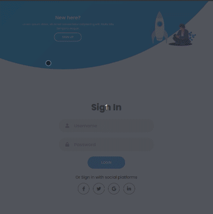
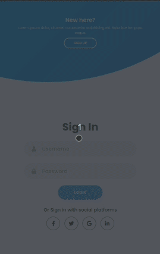

# Sliding Sign In and Sign Up Forms

Sample sign in and sign up forms page with sliding animations for toggling between them.

  

## :desktop_computer: Desktop layout

    

## :computer: Medium layout

    

## :iphone: Small layout

    

## :rocket: Technologies

- HTML
- CSS
- Vanilla Javascript

## :runner: Running Locally

Just open the `index.html` file in the browser. :wink:
